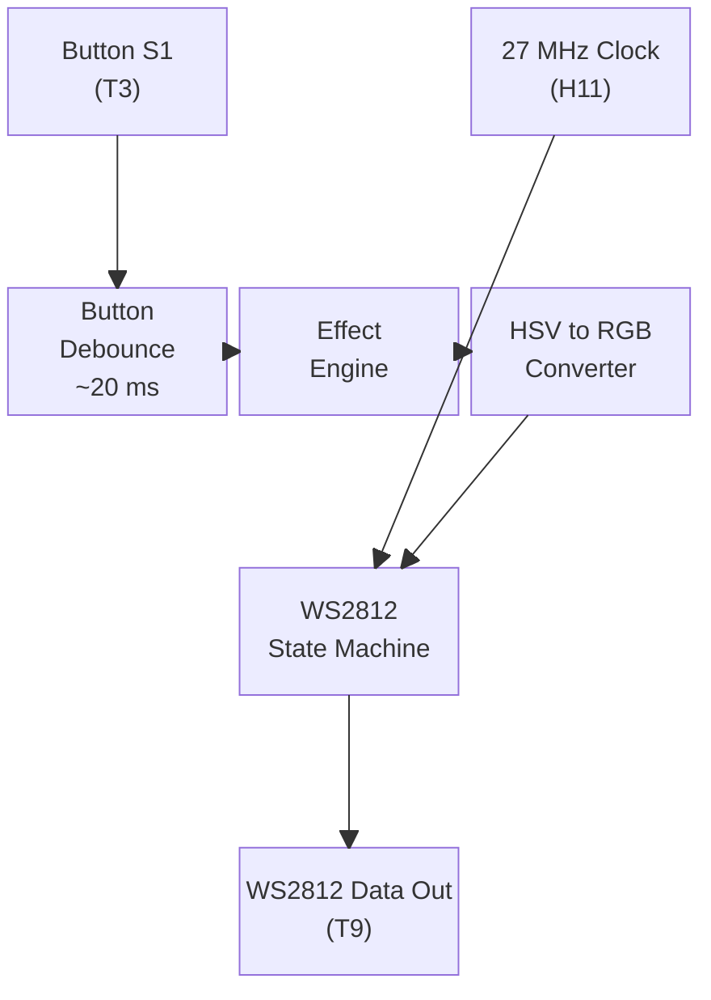
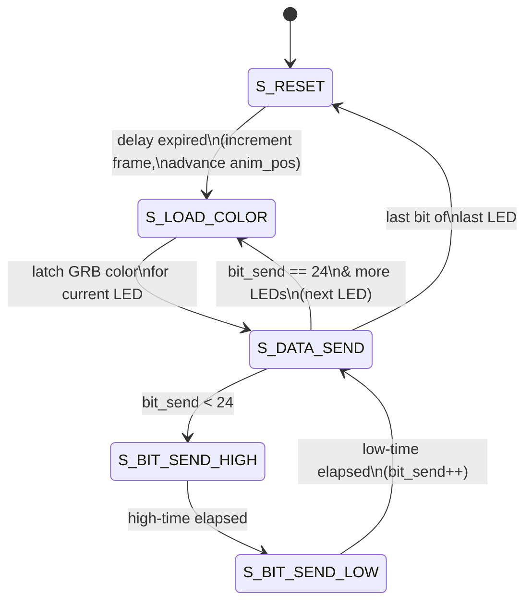
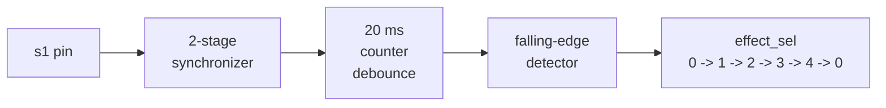
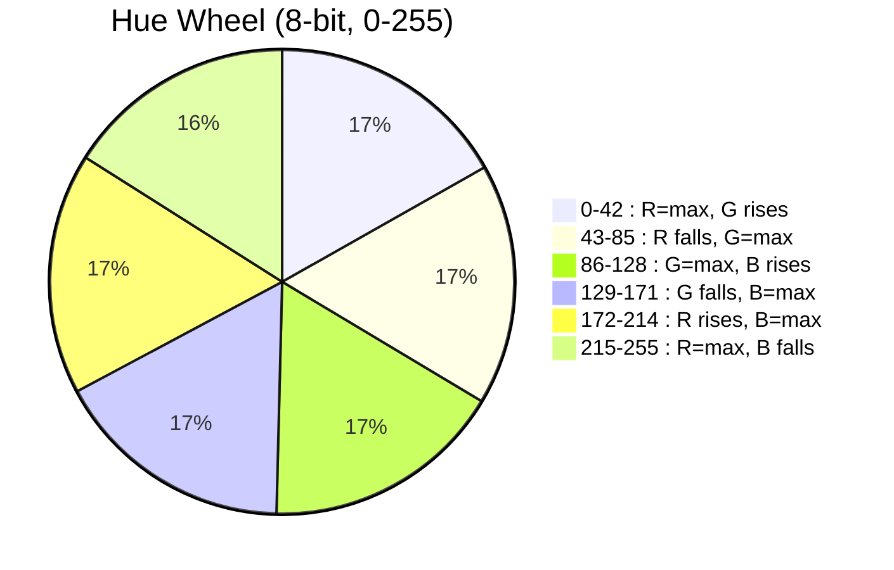
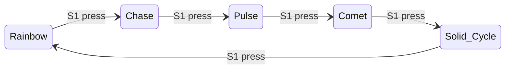

# WS2812 LED Controller -- Design Document

FPGA-based WS2812 LED strip controller with multiple color effects, targeting the
Gowin GW2A-18C (Tang Primer 20K). Drives a parameterized chain of WS2812 LEDs from
a single data pin, with effect selection via a physical button.

## Hardware

| Signal   | Pin | Description                     |
|----------|-----|---------------------------------|
| `clk`    | H11 | 27 MHz system clock             |
| `WS2812` | T9  | Serial data out to LED strip    |
| `s1`     | T3  | Button S1 (active low, dock board) |

## Parameters

| Parameter    | Default      | Description                          |
|--------------|--------------|--------------------------------------|
| `NUM_LEDS`   | 64           | Number of LEDs in the chain          |
| `CLK_FRE`    | 27,000,000   | Clock frequency in Hz                |
| `WS2812_WIDTH` | 24         | Bits per LED (24-bit GRB)            |

## System Architecture



The design is split into four functional blocks, all within a single `top` module.
There is no LED color RAM -- each LED's color is computed on the fly by the
combinational effect and HSV pipelines as the state machine steps through the chain.

## Main State Machine

The FSM drives the WS2812 serial protocol and coordinates color generation.



### State Descriptions

| State            | Output pin | Purpose                                        |
|------------------|------------|------------------------------------------------|
| `S_RESET`        | LOW        | Hold line low for 10 ms (frame period). On exit: increment `frame_count`, advance `anim_pos` every 5th frame. |
| `S_LOAD_COLOR`   | --         | One-cycle state. Latches the combinationally-computed GRB color for the current LED index (`data_send`) into `current_color`. |
| `S_DATA_SEND`    | --         | Routing state. Decides whether to send the next bit, load the next LED, or return to reset. |
| `S_BIT_SEND_HIGH`| HIGH       | Drives the data line high. Duration depends on the current bit value (see timing below). |
| `S_BIT_SEND_LOW` | LOW        | Drives the data line low for the complementary duration, then advances `bit_send`. |

## WS2812 Protocol Timing

Data is sent MSB-first, 24 bits per LED in GRB order. A "1" bit has a long
high pulse; a "0" bit has a short high pulse. All timing is derived from `CLK_FRE`.

```
Bit = 1:
         ___________________
        |      850 ns       |____400 ns____|
        |<-- DELAY_1_HIGH -->|<- 1_LOW  -->|

Bit = 0:
         _________
        | 400 ns  |________850 ns__________|
        |<- 0_HI->|<--- DELAY_0_LOW  ---->|

Reset (between frames):
        _______________..._______________
  LOW  |            >= 50 us             |
       |   (design uses 10 ms for       |
       |    frame-rate timing)           |
```

At 27 MHz, one clock cycle is ~37 ns. The timing parameters resolve to:

| Parameter        | Formula                  | Cycles | Actual Time |
|------------------|--------------------------|--------|-------------|
| `DELAY_1_HIGH`   | 27 * 0.85 - 1           | ~22    | ~814 ns     |
| `DELAY_1_LOW`    | 27 * 0.40 - 1           | ~9     | ~370 ns     |
| `DELAY_0_HIGH`   | 27 * 0.40 - 1           | ~9     | ~370 ns     |
| `DELAY_0_LOW`    | 27 * 0.85 - 1           | ~22    | ~814 ns     |
| `DELAY_RESET`    | 27,000,000 / 100 - 1    | 269,999| 10 ms       |

### Frame Transmission

For a chain of N LEDs, one complete frame looks like:

```
|<-- LED 0 (24 bits) -->|<-- LED 1 (24 bits) -->| ... |<-- LED N-1 -->|<-- RESET -->|
        ^                       ^                                           ^
   closest to FPGA         2nd in chain                              10 ms low
```

At 64 LEDs, the data portion takes ~64 * 24 * 1.25 us = ~1.92 ms, well within the
10 ms frame period.

## Button Debounce



The button is active-low. A 2-flip-flop synchronizer prevents metastability, then
a counter requires 540,000 consecutive agreeing samples (~20 ms at 27 MHz) before
accepting the new level. A falling-edge detector on the stable signal increments
`effect_sel` through the five effects.

## HSV to RGB Converter

The converter is purely combinational. It takes an 8-bit hue (0--255) and an 8-bit
value/brightness (0--255) and produces 8-bit R, G, B outputs. Saturation is fixed
at maximum (fully saturated colors).

The hue wheel is divided into six sectors of ~43 counts each:



Within each sector, `h_frac = (hue - sector_start) * 6` maps the position to 0--252.
The rising or falling channel is then computed as:

```
rising  = (hsv_val * h_frac) >> 8
falling = (hsv_val * (255 - h_frac)) >> 8
```

The `>> 8` approximation (dividing by 256 instead of 255) introduces less than
0.4% error -- invisible in LEDs.

The output is reordered to GRB for the WS2812 wire format: `{rgb_g, rgb_r, rgb_b}`.

## Effect Engine

Each effect is a combinational function of `frame_count`, `data_send` (current LED
index), and `anim_pos` (position counter). No per-LED storage is needed.

| # | Effect         | Hue Source                     | Brightness Rule                                       |
|---|----------------|--------------------------------|-------------------------------------------------------|
| 0 | **Rainbow**    | `frame[7:0] + LED * (256/N)`  | Constant 128. Hue spread evenly, all rotate.          |
| 1 | **Chase**      | `frame[9:2]` (slow drift)     | 255 if `LED == anim_pos`, else 0. Single lit LED moves. |
| 2 | **Pulse**      | `frame[11:4]` (very slow drift)| Triangle wave on `frame[8:0]`. All LEDs breathe together. |
| 3 | **Comet**      | `frame[11:4]`                  | 255/180/120/70/30/10/0 based on distance behind `anim_pos`. Bright head + 5-LED fading tail. |
| 4 | **Solid Cycle**| `frame[7:0]`                   | Constant 128. All LEDs same color, hue rotates.       |

### Animation Timing

- `frame_count` increments every frame (every 10 ms, ~100 fps)
- `anim_pos` advances every 5th frame (~20 steps/sec), wrapping at `NUM_LEDS`
- Effects use different bit slices of `frame_count` for speed variation:
  - `[7:0]` = full speed (completes hue cycle in ~2.5 s)
  - `[9:2]` = 1/4 speed (~10 s per cycle)
  - `[11:4]` = 1/16 speed (~40 s per cycle)

### Effect Cycling



## Resource Usage

The design is lightweight by construction:

- **No block RAM** -- colors are computed combinationally, not stored
- **Two 8x8 multipliers** -- used in HSV conversion (`hsv_val * h_frac` and `hsv_val * (255 - h_frac)`), maps to DSP slices on GW2A
- **One 9-bit x constant multiplier** -- `data_send * (256/NUM_LEDS)` for rainbow hue spacing, optimized to shifts when `NUM_LEDS` is a power of 2
- **32-bit counter** -- `clk_count` for timing; could be narrowed to 18 bits for just the protocol, but 32 bits covers the reset delay cleanly

## Customization

To adapt to a different setup:

| Change | Where |
|--------|-------|
| Number of LEDs | `NUM_LEDS` parameter in `top.v` |
| Clock frequency | `CLK_FRE` parameter (timing auto-derives) |
| LED data pin | `IO_LOC "WS2812"` in `top.cst` |
| Button pin | `IO_LOC "s1"` in `top.cst` |
| Add effects | Add a new `EFF_*` localparam, increment `NUM_EFFECTS`, add a case in the effect computation block |
| Comet tail length | Extend or shorten the `led_dist` case statement in `EFF_COMET` |
| Animation speed | Adjust `anim_subdiv` threshold (currently 4 = every 5th frame) or change `frame_count` bit slices in each effect |
